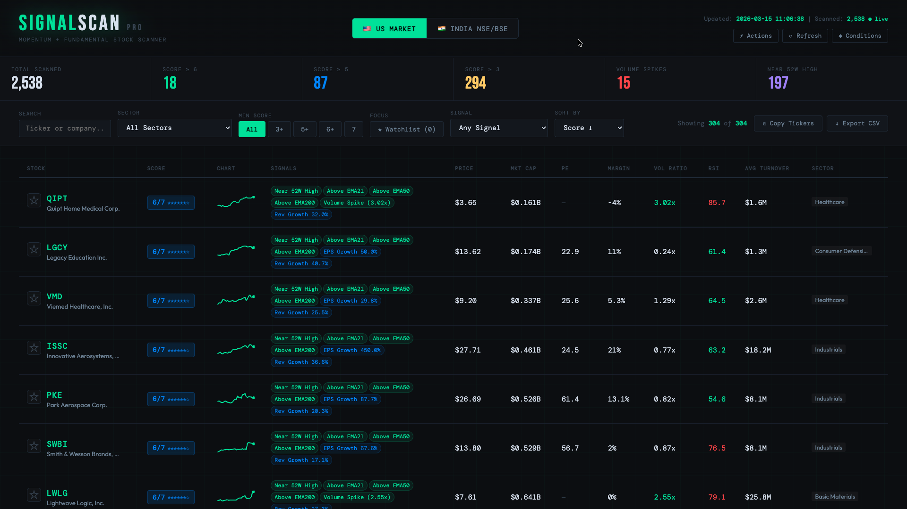
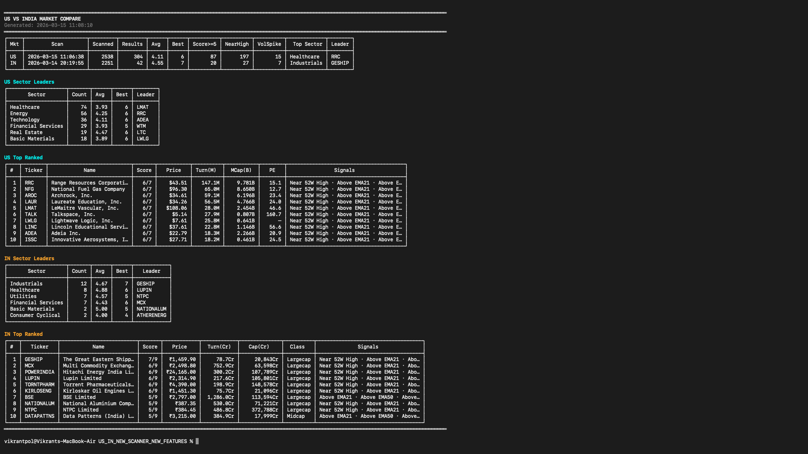
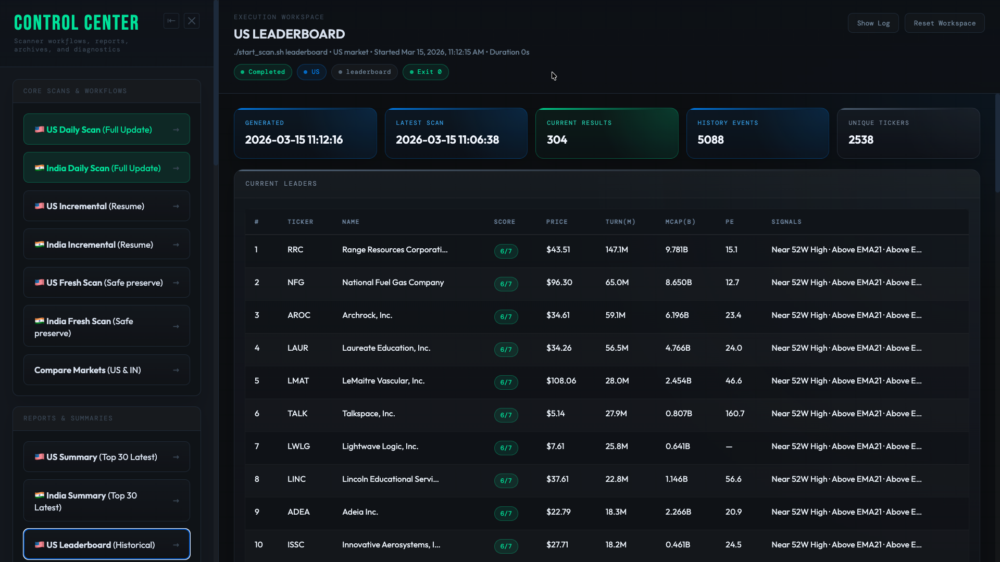

# US-India Signal Lab

Open-source shell-driven market scanner workspace for US equities and India NSE equities, with local history, archived reports, diff views, and a browser dashboard.

This repository is structured so the code can be public while the proprietary scan thresholds and broker credentials stay local-only.

## Preview


*Modern, IDE-like full-screen dashboard with Control Center and terminal output.*

<p align="center">
  
  
</p>
<p align="center">
  <em>Live terminal momentum scanning and polished report summaries.</em>
</p>

## What This Project Includes

- US scanner with resume/fresh workflows, reports, diffs, history, sector views, exports, and daily automation helpers
- India scanner with optional Fyers integration, cap-class summaries, reports, diffs, history, exports, and daily automation helpers
- Shared SQLite state and archive storage for scan progress, historical events, and generated artifacts
- A browser dashboard with a Control Center that can launch commands and render polished structured output
- Open-source-safe packaging that keeps private conditions and broker credentials outside tracked source

## Repository Layout

| Path | Purpose |
|------|---------|
| `start_scan.sh` | US launcher |
| `India_scan.sh` | India launcher |
| `scanner.py` | US scan engine |
| `india_scanner.py` | India scan engine |
| `scan_state.py` | Shared history, reporting, export, diff, doctor, and archive tooling |
| `scan_conditions_loader.py` | Loads local private scan conditions |
| `scan_conditions.example.json` | Public template for private scan conditions |
| `.env.example` | Public template for optional Fyers credentials |
| `dashboard.html` | Frontend dashboard |
| `api.py` | FastAPI backend for dashboard command execution and SSE streaming |
| `start_dashboard.sh` | Dashboard launcher |
| `doc/` | Detailed command and architecture notes |

## Security Model

This repo intentionally does not commit live broker credentials or the real scan thresholds.

Tracked public files:

- `.env.example`
- `scan_conditions.example.json`

Local private files:

- `.env`
- `.scanner_secrets/scan_conditions.json`
- `scan_conditions.local.json`

Generated local artifacts that should remain private:

- `scanner_results.json`
- `scanner_results_YYYY-MM-DD.json`
- `india_results.json`
- `india_results_YYYY-MM-DD.json`
- `scan_state.db`
- `scan_mega_history.db`
- `exports/`
- `backups/`
- `fyersApi.log`
- `fyersRequests.log`

Those generated files can reveal strategy behavior even if the source code is clean, so they are ignored by `.gitignore`.

## Requirements

- Python 3.8+
- Bash
- Git
- A browser for the dashboard
- Optional: Fyers credentials for richer India market data

## Quick Start

### 1. Clone the repo

```bash
git clone https://github.com/Vikkrantpol/us-india-signal-lab.git
cd us-india-signal-lab
```

### 2. Create the private scan conditions file

```bash
mkdir -p .scanner_secrets
cp scan_conditions.example.json .scanner_secrets/scan_conditions.json
chmod 700 .scanner_secrets
chmod 600 .scanner_secrets/scan_conditions.json
```

Then replace every placeholder value in `.scanner_secrets/scan_conditions.json` with your real local thresholds.

Alternative location:

```bash
export SCAN_CONDITIONS_FILE=/absolute/path/to/scan_conditions.json
```

### 3. Optional: create local broker config

If you want Fyers-backed India data:

```bash
cp .env.example .env
```

Then fill in the local values in `.env`.

If you leave `.env` blank, the India scanner still works in fallback mode without Fyers.

### 4. Run the scanners

US:

```bash
./start_scan.sh run
```

India:

```bash
./India_scan.sh run
```

### 5. Launch the dashboard

```bash
./start_dashboard.sh
```

Then open:

```text
http://localhost:8000/dashboard.html
```

## How Private Conditions Are Loaded

`scan_conditions_loader.py` resolves the private scan-conditions file in this order:

1. `SCAN_CONDITIONS_FILE`
2. `.scanner_secrets/scan_conditions.json`
3. `scan_conditions.local.json`
4. `$XDG_CONFIG_HOME/us_in_scanner/scan_conditions.json`
5. `~/.us_in_scanner/scan_conditions.json`

That lets you keep the exact thresholds outside the repo without changing the launcher commands.

## Launchers and Commands

### US launcher

Run `./start_scan.sh help` for the full built-in help.

| Command | Purpose |
|---------|---------|
| `run` | Resume/update US scan from current working state |
| `fresh` | Reset US working state, remove active US outputs, and rescan |
| `summary` | Show latest top-30 US table |
| `artifact-history` | Show archived generated outputs |
| `archive-query` | Query archived command-output rows |
| `ticker-history TICKER` | Show one ticker's archived timeline |
| `leaderboard` | Show current and historical leaders |
| `sector-report [sector]` | Show latest sector summary or drill into one sector |
| `sector-history [sector]` | Show archived sector snapshots or one sector timeline |
| `sector ...` | Friendly alias wrapper for sector workflows |
| `new-highs` | Show latest high-proximity names |
| `compare-markets` | Compare latest US and India outputs |
| `daily` | Run both scans, then diff/report/compare/export workflow |
| `daily-full` | Run both scans plus extended review tables and exports |
| `doctor` | Run environment and data health checks |
| `export [csv|md|both]` | Export latest US market view |
| `diff` | Compare latest US results against previous snapshot |
| `report` | Generate richer US report and archive it |
| `history` | Show archived US scan history |
| `download` | Refresh the US market-universe download step |
| `clean` | Remove `.venv/` |
| `help` | Show launcher help |

### India launcher

Run `./India_scan.sh help` for the full built-in help.

| Command | Purpose |
|---------|---------|
| `run` | Resume/update India scan |
| `fresh` | Reset India working state and rescan |
| `summary` | Show latest top-30 India table |
| `smallcap` | Show latest India smallcap table |
| `midcap` | Show latest India midcap table |
| `largecap` | Show latest India largecap table |
| `artifact-history` | Show archived generated outputs |
| `archive-query` | Query archived command-output rows |
| `ticker-history SYMBOL` | Show one symbol's archived timeline |
| `leaderboard` | Show current and historical leaders |
| `sector-report [sector]` | Show latest sector summary or drill into one sector |
| `sector-history [sector]` | Show archived sector snapshots or one sector timeline |
| `sector ...` | Friendly alias wrapper for sector workflows |
| `new-highs` | Show latest high-proximity names |
| `compare-markets` | Compare latest India and US outputs |
| `daily` | Run both scans, then diff/report/compare/export workflow |
| `daily-full` | Run both scans plus extended review tables and exports |
| `doctor` | Run environment and data health checks |
| `export [csv|md|both]` | Export latest India market view |
| `diff` | Compare latest India results against previous snapshot |
| `report` | Generate richer India report and archive it |
| `history` | Show archived India scan history |
| `help` | Show launcher help |

## Dashboard

The dashboard consists of:

- `dashboard.html` for the frontend
- `api.py` for the FastAPI backend
- `start_dashboard.sh` for the local launch flow

Current dashboard behavior includes:

- collapsible Control Center
- independent scrolling for command navigation and workspace panels
- live command execution via backend streaming
- polished report cards and tables instead of raw terminal dumps
- market-aware command actions for US and India workflows

`start_dashboard.sh` will:

- activate `venv/`
- install `fastapi`, `uvicorn`, `sse-starlette`, and `httpx` if needed
- start the FastAPI app from `api.py`

## Outputs and Storage

| File or Folder | Purpose |
|----------------|---------|
| `scanner_results.json` | Latest US result set |
| `scanner_results_YYYY-MM-DD.json` | Dated US snapshots |
| `india_results.json` | Latest India result set |
| `india_results_YYYY-MM-DD.json` | Dated India snapshots |
| `scan_state.db` | Current resume state and latest scan metadata |
| `scan_mega_history.db` | Permanent archive of scan events and generated artifacts |
| `exports/` | CSV/Markdown/workflow export bundles |

These are runtime artifacts, not public source assets.

## Open-Source Safe Workflow

To keep the repo public while preserving privacy:

- commit code, templates, and docs
- keep real thresholds in `.scanner_secrets/scan_conditions.json` or another local path
- keep broker credentials in `.env`
- do not publish generated result JSON, databases, logs, exports, or backup folders

The current `.gitignore` is already set up for that model.

## Troubleshooting

### Missing secure conditions file

Create the local file from the template:

```bash
mkdir -p .scanner_secrets
cp scan_conditions.example.json .scanner_secrets/scan_conditions.json
```

Or point `SCAN_CONDITIONS_FILE` to your private file.

### India scan without Fyers

You can still run `./India_scan.sh run` without broker credentials. The scanner falls back where possible, but some live-limit or market-microstructure enrichments will not be available.

### Dashboard dependencies missing

If the dashboard backend fails due to missing FastAPI dependencies, rerun:

```bash
./start_dashboard.sh
```

The script installs the required packages into `venv/` automatically.

## Additional Documentation

- `doc/start_scan.md`
- `doc/India_scan.md`
- `doc/start_dashboard.md`
- `doc/launcher_command_reference.md`
- `doc/US_IN_Scanner_Documentation.md`
- `doc/open_source_release.md`

## Privacy Status of This Public Repo

The committed repo is designed to keep these private:

- real broker keys
- real scan thresholds

Only placeholder templates are committed. If you share the working directory manually instead of pushing through git, you still need to exclude the private local files and generated artifacts listed above.

## Future Roadmap: Sub-4-Minute Scans

The current 15-minute runtime is primarily limited by the aggressive rate-limiting required for scraping external data providers. To reduce the runtime to **under 4 minutes**, the following architecture is planned:

### 1. Hybrid Scan Architecture
- **Hard Scan (Weekly)**: Performs full yFinance `.info` lookups for fundamentals (PE, Growth, Margins). These are stored in a local `fundamental_cache`.
- **Cached Scan (Daily)**: Merges the cached fundamentals with live price data from the Broker API.

### 2. Broker API Integration
- **Direct Quotes**: Using Fyers (India) and high-speed US broker APIs to fetch CMP, volume, and 52-week proximity data in bulk.
- **Bulk Requests**: Sending batches of 50-100 symbols per API call to eliminate per-ticker loop latency.

### 3. Optimized Latency
- **Minimized Sleep**: Transitioning from 1-3 second per-ticker delays to 1-2 second per-chunk pauses.
- **Concurrent Processing**: Leveraging asynchronous I/O and bulk history downloads for technical indicator calculations (EMAs, RSI).
